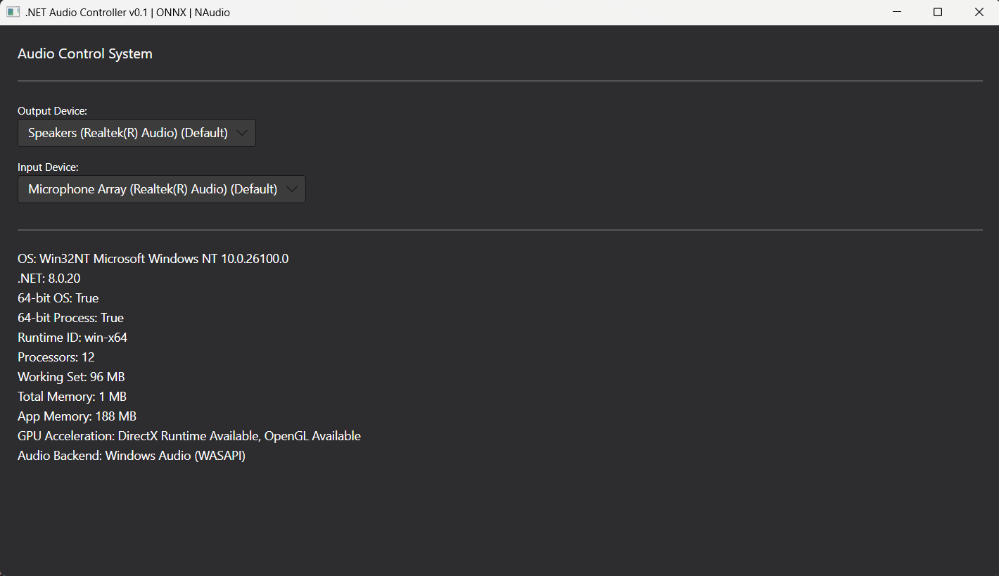

# dotnet-audio-app

This repository contains a template for a .NET desktop audio application built with Avalonia UI, NAudio, and ONNX Runtime (for AI capabilities, future). Focus on developing with open libraries and models. Tested on Windows 11.



### Setup Instructions:

#### Prerequisites
- .NET 8 SDK (LTS) - [Download here](https://dotnet.microsoft.com/download)

#### Windows Setup:
```powershell
# Install .NET 8 SDK
winget install --id Microsoft.DotNet.SDK.8 -e
dotnet -v

# Clone and navigate to project
git clone https://github.com/vecnode/dotnet-audio-app.git
cd dotnet-audio-app

# Build and run
dotnet clean src/App/App.csproj  
dotnet build src/App/App.csproj  
dotnet run --project src/App/App.csproj  

# Or use the PowerShell script
.\start.ps1 

# For Release build (Windows)
dotnet publish src/App/App.csproj -c Release -r win-x64 --self-contained true   
```


### Features

- Compiles Avalonia, NAudio and ONNX
- Accesses available audio input/output devices
- Accesses system information (OS, hardware)


### Design Guidelines

- This repository should be developed as cross-platform as possible.
- (future) For best cross-platform behavior, the script should start with CPU ONNX Runtime. 
- On Windows, we will enable GPU via DirectML in the future (no CUDA install needed):
- `start.ps1` should be enough for Windows development.
- `updaye.ps1` is to setup the repository folder on Windows.

### Next steps

- Manually ask for permissions (UI)
- Time clock
- Develop a modular build to include ONNX (or not)
- Develop a Docker image and test on WSL2
- Allow for audio card switching and tone test on OUT
- Allow for Microphone Audio IN
