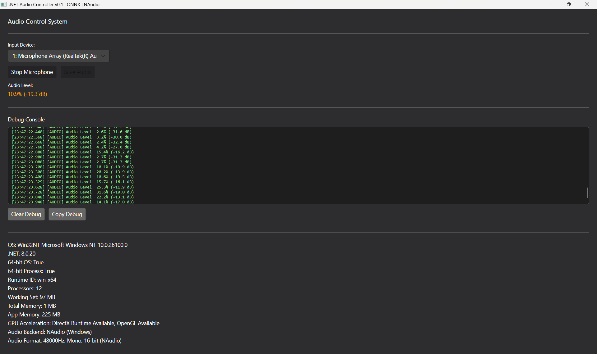

# dotnet-audio-app

This repository contains a template for a .NET desktop audio application built with Avalonia UI, NAudio, and ONNX Runtime (for AI capabilities, future). Focus on developing with open libraries and models. Tested on Windows 11.



### Setup Instructions:

#### Prerequisites
- .NET 8 SDK (LTS) - [Download here](https://dotnet.microsoft.com/download)


#### Windows Setup:
```powershell
# Install .NET 8 SDK
winget install --id Microsoft.DotNet.SDK.8 -e
dotnet -v

# Clone and navigate to project
git clone https://github.com/vecnode/dotnet-audio-app.git
cd dotnet-audio-app

# Build and run
dotnet clean src/App/App.csproj  
dotnet build src/App/App.csproj  
dotnet run --project src/App/App.csproj  

# Or use the PowerShell script
.\start.ps1 

# Windows (self-contained, single-file, natives auto-extracted)
dotnet publish src/App/App.csproj -c Release -r win-x64 --self-contained true

# Linux
dotnet publish src/App/App.csproj -c Release -r linux-x64 --self-contained true

# macOS (Intel & Apple Silicon)
dotnet publish src/App/App.csproj -c Release -r osx-x64    --self-contained true
dotnet publish src/App/App.csproj -c Release -r osx-arm64  --self-contained true

```


### Features

- Compiles Avalonia, NAudio and ONNX
- Microphone Input Selection
- Real-time Audio Level Monitor
- WAV File Recording
- WAV File Export
- Accesses System Info (OS, Hardware)


### Packages 

```powershell
   [net8.0]: 
   Top-level Package                    Requested    Resolved
   > Avalonia                           11.3.5       11.3.5
   > Avalonia.Desktop                   11.3.5       11.3.5
   > Avalonia.Diagnostics               11.3.5       11.3.5
   > Avalonia.Fonts.Inter               11.3.5       11.3.5
   > Avalonia.ReactiveUI                11.3.5       11.3.5
   > Avalonia.Themes.Fluent             11.3.5       11.3.5
   > Microsoft.ML.OnnxRuntime           1.16.3       1.16.3
   > Microsoft.NET.ILLink.Tasks   (A)   [8.0.20, )   8.0.20
   > NAudio                             2.2.1        2.2.1
```


### Design Guidelines

- This repository should be developed as cross-platform as possible.
- (future) For best cross-platform behavior, the script should start with CPU ONNX Runtime. 
- On Windows, we will enable GPU via DirectML in the future (no CUDA install needed):
- `start.ps1` should be enough for Windows development.
- `update.ps1` updates the repository folder on Windows.

### Next steps

- Loader of waveforms with amplitude visualiser
- Time clock might that keeps track of requests and logs (e.g. XML)
- Develop a modular build to include ONNX (or not)
- Develop a Docker image and test on WSL2

