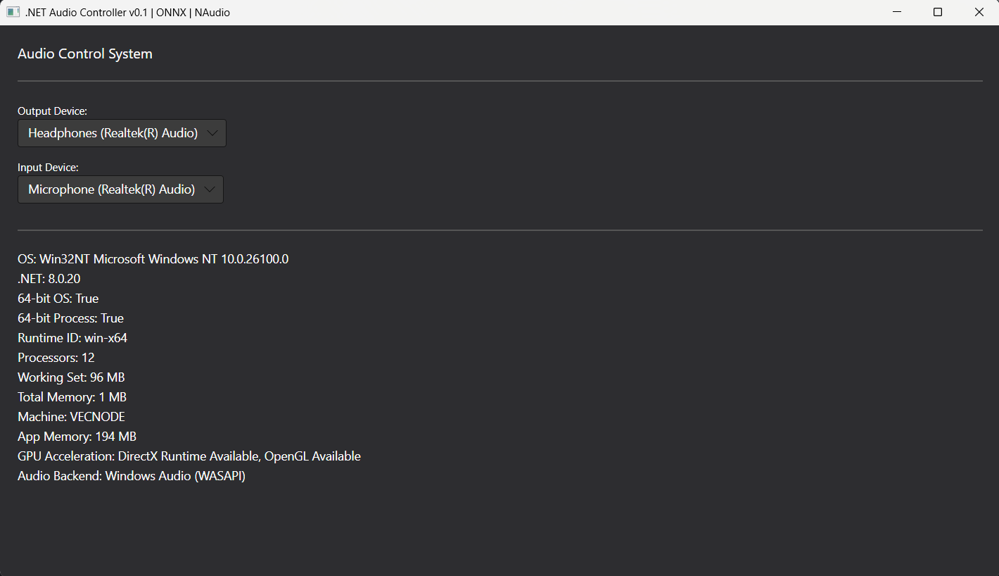

# dotnet-audio-app

This repository contains a cross-platform .NET desktop audio application that interfaces with system audio on Windows, Linux, and macOS. Built with Avalonia UI, NAudio, and ONNX Runtime for AI capabilities. This repository focuses on developing with open libraries and models. Tested on Windows 11, Ubuntu 22.04, and macOS.



### Setup Instructions:

#### Prerequisites
- .NET 8 SDK (LTS) - [Download here](https://dotnet.microsoft.com/download)

#### Windows Setup:
```powershell
# Install .NET 8 SDK
winget install --id Microsoft.DotNet.SDK.8 -e
dotnet -v

# Clone and navigate to project
git clone https://github.com/vecnode/dotnet-audio-app.git
cd dotnet-audio-app

# Build and run
dotnet clean src/App/App.csproj  
dotnet build src/App/App.csproj  
dotnet run --project src/App/App.csproj  

# Or use the PowerShell script
.\start.ps1 

# For Release build (Windows)
dotnet publish src/App/App.csproj -c Release -r win-x64 --self-contained true   
```

#### Linux Setup:
```bash
# Install .NET 8 SDK (Ubuntu/Debian)
wget https://packages.microsoft.com/config/ubuntu/22.04/packages-microsoft-prod.deb -O packages-microsoft-prod.deb
sudo dpkg -i packages-microsoft-prod.deb
sudo apt-get update
sudo apt-get install -y dotnet-sdk-8.0

# Clone and navigate to project
git clone https://github.com/vecnode/dotnet-audio-app.git
cd dotnet-audio-app

# Build and run
dotnet clean src/App/App.csproj
dotnet build src/App/App.csproj
dotnet run --project src/App/App.csproj

# For Release build (Linux)
dotnet publish src/App/App.csproj -c Release -r linux-x64 --self-contained true
```

#### macOS Setup:
```bash
# Install .NET 8 SDK
brew install --cask dotnet-sdk

# Clone and navigate to project
git clone https://github.com/vecnode/dotnet-audio-app.git
cd dotnet-audio-app

# Build and run
dotnet clean src/App/App.csproj
dotnet build src/App/App.csproj
dotnet run --project src/App/App.csproj

# For Release build (macOS)
dotnet publish src/App/App.csproj -c Release -r osx-x64 --self-contained true
```  

### Features

- Compiles Avalonia, NAudio and ONNX
- Accesses available audio input/output devices
- Accesses system information (OS, hardware)


### Design Guidelines

- This repository should be developed as cross-platform as possible.
- For best cross-platform behavior, the script should start with CPU ONNX Runtime. 
- On Windows, we will enable GPU via DirectML in the future (no CUDA install needed):
- `start.ps1` starts `run.ps1` and that should be enough for Windows/Linux development.
- `setup_env.ps1` is to setup the repository from version control a first time and fix `.\cache\` and `.\cache\packages\`

Uncomment the DirectML block in run.ps1, or run once:  
  
```
dotnet add src/App/App.csproj package Microsoft.ML.OnnxRuntime.DirectML
```    

### Next steps

- Manually ask for permissions
- Time clock
- Develop a modular build to include ONNX (or not)
- Develop a Docker image and test on WSL2
- Allow for audio card switching and tone test on OUT
- Allow for Microphone Audio IN
